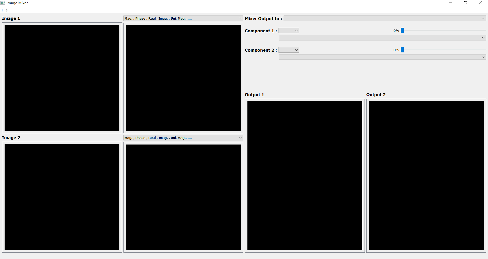

# Image Mixer

## About:

 This is an individual project in Digital Signal Processiong Course.My software is implemented to open two images of  the same size from PC, and if the user open image 2 with size different from image 1 , error message appears including the size of image 1 that should be opened. 
The user can get different components of each image including : Magnitude , Phase, Real ,Imaginary , Uniform Phase and Uniform Magnitude for each image separately in different windows anf the user can select each component from a comboBox.

The second part of the software mix between components of these two images,
the user can form up to two outputs , in each output the user can mix between Magnitude and Phase or Uniform Phase ,Real and Imaginary , Phase and Uniform Magnitude (these are only the available mixing components as when the user choose any of them in the ComboBox of Component one ,the other ComboBox eappears only the available components to the choosen component. 
The user can mix between componnets of image 1 and 2 , and between the components of same image as well.

## Results:
Results:
1- Main Window:

2- Mixing Output:

